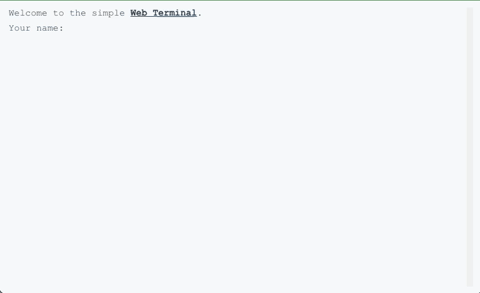

# Simple Web Terminal

[](https://github.com/lvcabral/terminal/releases/tag/v0.1.0)
[](./LICENSE)

> A simple and lightweight Javascript web browser terminal



Web apps are great. But sometimes instead of all the double-clicks, mouse pointers, taps and swipes across the screen - you just want good old keyboard input. This terminal runs in a browser, desktop or mobile. It provides a simple and easy way to extend the terminal with your own commands.

## How to use

Include `web-terminal.js` in your HTML:

```html
<script src="web-terminal.min.js"></script>
```

Define an HTML div tag where the terminal will be contained:

```html
<div id="web-terminal"></div>
```

Create a new terminal instance and convert the DOM element into a live terminal.

```js
const terminal = new WebTerminal();
```

If you want use another DOM element as container just set the property `container`:

```js
const terminal = new WebTerminal({ container: 'my-terminal-container' });
```

### Add your own commands

If you want add your own commands to the terminal just pass a object using the *property* as your command and the *value* as the callback.

```js
const commands = {
  switch: (terminal) => {
    terminal.output('This is a custom command of <b>web terminal<b>.')
    terminal.setPrompt('Custom Prompt &gt; ');
  },

  ping: (instance, parameters) => {
    instance.output('Ping to <u>${parameters[0]}</u>...');
  },
};

const terminal = new WebTerminal({ commands });
```

Now in your terminal could type your new commands:

```bash
> help
These shell commands are defined internally:
flavour, ping, clear, help, version, wipe

> switch
This is a custom command of web terminal.
Custom Prompt >
```

## Methods

### clear

```js
terminal.clear();
```

### output

```js
terminal.output('I like ice-cream.');
```

```bash
I like ice-cream.
>
```

### prompt

```js
terminal.prompt('Type your name', (name) => {
  terminal.output(`Hi ${name}!`);
});
```

```bash
Type your name: javi
Hi javi!
>
```

### onInput

```js
terminal.onInput((command, parameters) => {
  console.log('⚡️onInput', command, parameters);
});
```

### setPrompt

```js
terminal.setPrompt('user @ web');
```

```bash
user @ web >
```

## License

This repository is a fork from the [https://github.com/soyjavi/vanilla-terminal](vanilla-terminal) and is licensed under the [MIT License](/LICENSE).
